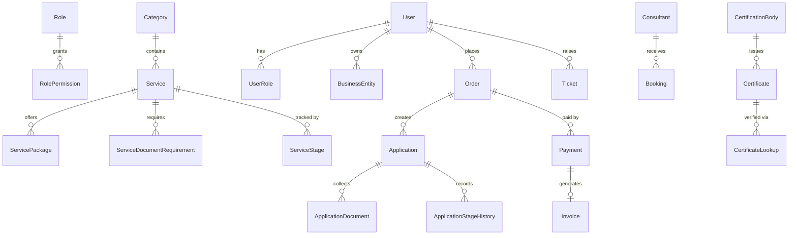

# Data model overview

The source of truth is `apps/api/prisma/schema.prisma`. Core relationships:

```mermaid
erDiagram
  User ||--o{ UserRole : has
  Role ||--o{ RolePermission : grants
  User ||--o{ BusinessEntity : owns
  Category ||--o{ Service : contains
  Service ||--o{ ServicePackage : offers
  Service ||--o{ ServiceDocumentRequirement : requires
  Service ||--o{ ServiceStage : "tracked by"
  User ||--o{ Order : places
  Order ||--o{ Application : creates
  Application ||--o{ ApplicationDocument : collects
  Application ||--o{ ApplicationStageHistory : records
  Order ||--o{ Payment : "paid by"
  Payment ||--o| Invoice : generates
  Consultant ||--o{ Booking : receives
  CertificationBody ||--o{ Certificate : issues
  Certificate ||--o{ CertificateLookup : "verified via"
  User ||--o{ Ticket : raises
```
